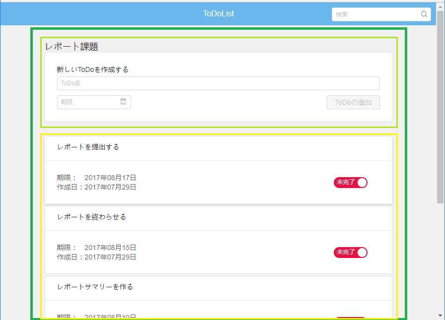

# React-todolist

This project is written as a process of employment selection of Teamlab.
このプロジェクトはチームラボの選考の一環として作られています。

### Features
---
  - ToDoリスト一覧を表示
  - ToDoリスト作成
  - ToDoの表示
  - ToDoの追加
  - ToDoの状態変更
  - ToDoの検索
  - 利用者の識別

### Tech
---
* [React] - A javascript library for building user interfaces.
* [React-router] - Declarative routing for React.
* [Babel] - The compiler for writing next generation JavaScript.
* [webpack] - Webpack is a module bundler for modern JavaScript applications.
* [Redux] - Redux is a predictable state container for JavaScript apps.
* [whatwg-fetch] - The Fetch standard defines requests, responses, and the process that binds them: fetching.
* [node.js] - Node.js is a JavaScript runtime built on Chrome's V8 JavaScript engine.
* [koa] - Next generation web framework for node.js.
* [mongoose] - Elegant mongodb object modeling for node.js.

### Composition & Design
---
##### Directory

| Name | Description |
| ------ | ------ |
| app | フロントエンド  |
| ├ actions| アプリケーションからストアにデータを送信する情報のペイロードのクリエーター |
| ├ components| UIから分割された独立した再利用可能な部分 |
| ├ config| UIに表示される文字列 |
| ├ constants| アクションタイプの文字列定数 |
| ├ containers| コンポーネントに具体的なデータやコールバック関数を与える構造 |
| ├ fetch| Ajaxの代わりにRequestを簡潔化するもの |
| ├ reducers| アプリケーションの状態がどのように変化するかと記載している |
| ├ router| ルータのコンフィグレーション |
| ├ static| 汎用的なもの |
| ├ store| actionsとreducersを結びつけるオブジェクト |
| ├ util| ユーティリティ |
| └ index.jsx| エントリー・ポイント |
| server | バックエンド |
| ├ cookie.jsx | cookieを利用してユーザーを区別する |
| ├ database.js | データベースの配置設定 |
| └ server.js| フロントエンドからの要請を処理する |

##### Components design

  - **Red:** Header component.
  - **Pink:** Search input component.
  - **Indigo:** Body.
  - **Purple:** CreateList component.
  - **Lavender:** TodoList component.


  - **Green:** DetailList component.
  - **Lime:** AddItem component.
  - **Yellow:** ListItem component.


  - **Pale Yellow:** ErrorPage component.


  - **Brown:** Search component.

### Installation
---
React-todolistを実行するために、[Node.js] と [MongoDB](https://www.mongodb.com/) が必要とされています。

DependenciesとdevDependenciesをインストールし、サーバーを起動します。
その前に、MongoDBがオンになっていることを確認してください。

```sh
> cd react-todolist
> npm install
> npm run server
```

サーバーを起動してから、引き続き...

```sh
> cd react-todolist
> npm run start
```

[//]: # 

   [React]: <https://facebook.github.io/react/>
   [React-router]: <https://github.com/ReactTraining/react-router>
   [Babel]: <https://babeljs.io/>
   [webpack]: <https://webpack.js.org/>
   [Redux]: <https://github.com/reactjs/redux>
   [whatwg-fetch]: <https://github.com/whatwg/fetch>
   [node.js]: <http://nodejs.org>
   [koa]: <http://koajs.com/>
   [mongoose]: <http://mongoosejs.com/>
